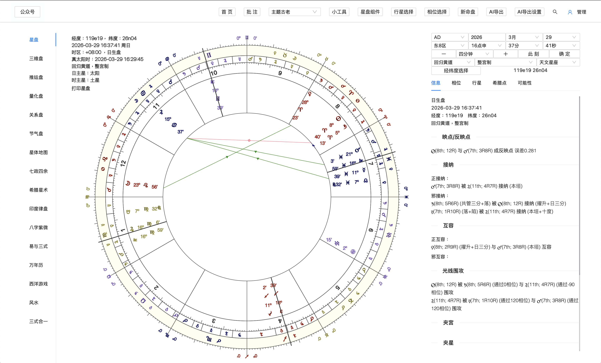
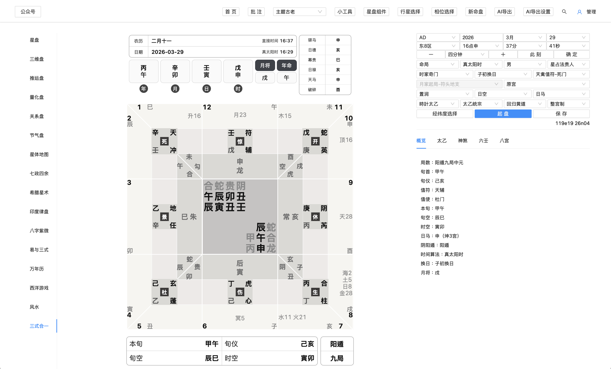

简体中文 | [English](README_EN.md)

# 星阙 Horosa for macOS

### A desktop metaphysics workstation for Apple Silicon
### 面向 Apple Silicon 的桌面玄学工作站

[中文完整版](README_ZH.md) | [English Guide](README_EN.md) | [Latest Release](https://github.com/Horace-Maxwell/Horosa-Web-App-comprehensively-improved-MacOS/releases/latest) | [v1.3.1 版本页面](https://github.com/Horace-Maxwell/Horosa-Web-App-comprehensively-improved-MacOS/releases/tag/v1.3.1) | [All Releases](https://github.com/Horace-Maxwell/Horosa-Web-App-comprehensively-improved-MacOS/releases)

Horosa on macOS is delivered as a signed, notarized, offline-ready desktop product for cross-tradition analysis.

macOS 版 Horosa 以签名、公证、离线可安装的正式桌面产品形态交付，用来承载跨传统的术数分析工作流。

<strong>Current release train / 当前发布线：v1.3.1</strong>

<strong>Release focus / 本次重点：</strong><code>v1.3.1</code> adds Part of Fortune to primary-direction output, keeps Core-Alchabitius separate from Horosa legacy calculation, and synchronizes AI export with the table result path.

<strong>Licensing note / 许可证说明：</strong>the public repository now ships under <code>AGPL-3.0</code> because the released stack integrates Swiss Ephemeris / <code>pyswisseph</code>; upstream third-party subdirectories keep their own original notices.

## Start Here / 先看这里

<table>
  <tr>
    <td width="50%">
      <strong>English</strong>  
      End users should download the offline installer and open Horosa like a finished macOS app. 
      <a href="https://github.com/Horace-Maxwell/Horosa-Web-App-comprehensively-improved-MacOS/releases/latest/download/Horosa-Installer-macos-arm64-offline.pkg"><strong>Download the offline .pkg</strong></a>
    </td>
    <td width="50%">
      <strong>中文</strong>  
      普通用户请直接下载离线安装包，像标准 macOS 桌面软件一样安装和打开 Horosa。 
      <a href="https://github.com/Horace-Maxwell/Horosa-Web-App-comprehensively-improved-MacOS/releases/latest/download/Horosa-Installer-macos-arm64-offline.pkg"><strong>下载离线 .pkg</strong></a>
    </td>
  </tr>
  <tr>
    <td width="50%">
      Maintainers should start from the bilingual guides and the current GitHub Release page instead of guessing from asset names.
    </td>
    <td width="50%">
      维护者请从双语说明和当前 GitHub Release 页面进入，不要只靠 release 资产名反推结构。
    </td>
  </tr>
</table>

## Preview / 截图预览

  
<strong>Main Workspace / 主界面工作区</strong>

  
  
<em>The primary Horosa desktop workspace for chart reading, controls, and everyday use.</em>

  
<em>Horosa 的核心桌面工作区，用于盘面浏览、参数控制与日常使用。</em>

  
<strong>Sanshi Workspace / 三式合一工作区</strong>

  
  
<em>An advanced workflow view that highlights Sanshi and deeper tool-driven analysis.</em>

  
<em>更偏高级功能的一面，用于体现三式合一与更深层的工具化分析场景。</em>

## At A Glance / 一眼看懂

<table>
  <tr>
    <td width="50%">
      <strong>English</strong>  
      Horosa combines Western astrology, timing systems, relationship charts, Chinese traditional methods, Yi and Sanshi workflows, Feng Shui, and AI-oriented export controls inside one desktop surface.
    </td>
    <td width="50%">
      <strong>中文</strong>  
      Horosa 把西方占星、推运体系、关系盘、中国传统术数、易与三式、风水与 AI 导出控制整合进同一个桌面工作面。
    </td>
  </tr>
  <tr>
    <td width="50%">
      The macOS delivery is already shaped as a real desktop release: Developer ID signing, Apple notarization, offline install, update delivery, and a clear public download path.
    </td>
    <td width="50%">
      macOS 交付已经具备正式桌面产品的基本形态：Developer ID 签名、Apple 公证、离线安装、更新交付，以及明确的公开下载入口。
    </td>
  </tr>
</table>

## Signature Workflows / 代表性工作流

### Natal To Timing / 从本命到时运

English: Start from natal and 3D chart reading, then move into primary directions, zodiacal releasing, firdaria, profection, solar arc, returns, and annual methods without leaving the same desktop product.

中文：从本命盘和三维盘进入，再继续切到主/界限法、黄道星释、法达、小限、太阳弧、返照与流年法，不需要离开同一个桌面产品。

### Relationship Analysis / 关系分析

English: The relationship layer already includes compare, composite, synastry, time-space midpoint, and Marks charts as parallel ways to inspect the same relationship.

中文：关系分析层已经覆盖比较盘、组合盘、影响盘、时空中点盘与马克斯盘，用不同结构切同一段关系。

### Chinese Traditional Stack / 中国传统术数栈

English: Bazi, Ziwei, calendar, Feng Shui, and supporting references already live in the same workspace, so the product feels like a broader traditional stack rather than a single-method tool.

中文：八字、紫微斗数、万年历、风水和配套参考入口已经进入同一工作面，所以它更像一整套中国传统术数栈，而不是某一术的单点工具。

### Yi And Sanshi Depth / 易与三式纵深

English: Yi and Sanshi go beyond standalone tabs through Su Zhan, Yi Gua, Liu Ren, Jin Kou, Dun Jia, Tai Yi, Tong She Fa, and a deeper Sanshi United surface.

中文：易与三式不只是单术入口，还包含宿盘、易卦、六壬、金口诀、遁甲、太乙、统摄法，以及更深的三式合一综合工作区。

## Capability Matrix / 功能矩阵

### Western Astrology / 西方占星

English: A continuous chain from natal reading to timing and relationship work.

中文：从本命阅读到推运、关系分析的连续链路。

- Natal chart and 3D chart / 星盘、本命盘、三维盘
- Timing stack including primary directions, returns, solar arc, and annual methods / 覆盖主限、返照、太阳弧与流年法的推运栈
- Compare, composite, synastry, time-space midpoint, and Marks charts / 比较盘、组合盘、影响盘、时空中点盘、马克斯盘

### Global And Specialty Modules / 全球与专门模块

English: A broader surface than the default desktop astrology stack.

中文：比常见桌面占星软件更宽的专门模块面。

- Jieqi charts / 节气盘
- Astrocartography and planetary maps / 星体地图与地理占星
- Qizheng Siyu, Hellenistic, Indian, and quantitative views / 七政四余、希腊星术、印度律盘、量化盘

### Chinese Traditional And Divination / 中国传统与术数

English: A structured traditional system rather than a decorative side module.

中文：系统化组织的传统术数层，而不是点缀式附属模块。

- Bazi, Ziwei, gua-symbol references, twelve-palace tools, and rule references / 八字、紫微斗数、八卦类象、十二串宫、规则参考
- Calendar and Feng Shui as first-class modules / 万年历与风水作为正式模块
- Yi and Sanshi modules across standalone and integrated surfaces / 易与三式兼具单术入口与整合面

### Desktop Workflow / 桌面工作流

English: Controls for shaping, filtering, inspecting, and exporting analysis sessions.

中文：围绕分析、筛选、检查与导出的桌面控制层。

- Chart configuration, aspect selection, planet selection / 星盘配置、相位选择、行星选择
- Chart components and utility tools / 星盘组件与小工具
- AI export and AI export settings / AI 导出与 AI 导出设置

## New In v1.2.0 / v1.2.0 新增重点

<table>
  <tr>
    <td width="50%">
      <strong>English</strong>  
      <code>AIAnalysis</code> is now a first-class workspace rather than a small export helper. The current 1.2.0 release adds a dedicated right-side tab stack for Analyze, History, Materials, Templates, and Settings, with local-first persistence shared between web and app runtime modes.
    </td>
    <td width="50%">
      <strong>中文</strong>  
      <code>AIAnalysis</code> 现在已经是正式工作区，不再只是一个轻量导出附属入口。当前 1.2.0 版本加入了右侧独立的分析、历史、资料、模版、设置五个页签，并且以本地优先持久化为核心，同时被 Web 与 App 运行态共同复用。
    </td>
  </tr>
  <tr>
    <td width="50%">
      - streaming AI responses with provider-native forwarding 
      - conversation history, favorites, archive, batch export, and backup/restore 
      - materials, templates, bundles, JSON schema validation, and provider diagnostics 
      - DeepSeek and other mainstream provider presets already wired into the shared frontend
    </td>
    <td width="50%">
      - 原生 provider 流式转发的 AI 输出 
      - 对话历史、收藏、归档、批量导出、备份与恢复 
      - 资料、模版、组合、JSON schema 校验、provider 诊断 
      - DeepSeek 等主流 provider 预设已接入共享前端
    </td>
  </tr>
</table>

## Get Started / 下载与文档导航

<table>
  <tr>
    <td width="50%">
      <strong>English</strong>  
      Public install entry: <code>Horosa-Installer-macos-arm64-offline.pkg</code> 
      Best for Apple Silicon users, weak-network environments, offline forwarding, and first-time installs.  
      <a href="https://github.com/Horace-Maxwell/Horosa-Web-App-comprehensively-improved-MacOS/releases/latest/download/Horosa-Installer-macos-arm64-offline.pkg"><strong>Open download</strong></a>
    </td>
    <td width="50%">
      <strong>中文</strong>  
      公开安装入口：<code>Horosa-Installer-macos-arm64-offline.pkg</code> 
      适合 Apple Silicon、弱网环境、离线转发和第一次安装的普通用户。  
      <a href="https://github.com/Horace-Maxwell/Horosa-Web-App-comprehensively-improved-MacOS/releases/latest/download/Horosa-Installer-macos-arm64-offline.pkg"><strong>打开下载</strong></a>
    </td>
  </tr>
</table>

## Documentation / 文档导航

<table>
  <tr>
    <td width="50%">
      <strong>English</strong>  
      <a href="README_EN.md">README_EN.md</a>: full English guide 
      <a href="README_ZH.md">README_ZH.md</a>: Chinese full guide 
      <a href="https://github.com/Horace-Maxwell/Horosa-Web-App-comprehensively-improved-MacOS/releases/tag/v1.3.1">v1.3.1 release page</a> 
      <a href="https://github.com/Horace-Maxwell/Horosa-Web-App-comprehensively-improved-MacOS/releases">All releases</a> 
      <a href="Horosa_Desktop_Installer/README.md">Installer internals</a>
    </td>
    <td width="50%">
      <strong>中文</strong>  
      <a href="README_ZH.md">README_ZH.md</a>：中文完整说明 
      <a href="README_EN.md">README_EN.md</a>：英文完整说明 
      <a href="https://github.com/Horace-Maxwell/Horosa-Web-App-comprehensively-improved-MacOS/releases/tag/v1.3.1">v1.3.1 版本页面</a> 
      <a href="https://github.com/Horace-Maxwell/Horosa-Web-App-comprehensively-improved-MacOS/releases">所有 Release</a> 
      <a href="Horosa_Desktop_Installer/README.md">安装器内部说明</a>
    </td>
  </tr>
</table>

<strong>Developer Entry / 开发者入口</strong>

<table>
  <tr>
    <td width="50%">
      <strong>English</strong>  
      Understand the public-facing repository layout: <a href="README.md">README.md</a> 
      Inspect installer internals and publishing flow: <a href="Horosa_Desktop_Installer/README.md">Horosa_Desktop_Installer/README.md</a> 
      Read the current version release page: <a href="https://github.com/Horace-Maxwell/Horosa-Web-App-comprehensively-improved-MacOS/releases/tag/v1.3.1">v1.3.1</a> 
      Enter the application source tree: <code>Horosa-Web/</code> 
      Inspect runtime and diagnostics: <code>runtime/</code>, <code>diagnostics/</code>
    </td>
    <td width="50%">
      <strong>中文</strong>  
      理解首页与用户入口：<a href="README.md">README.md</a> 
      查看安装器与发布链路：<a href="Horosa_Desktop_Installer/README.md">Horosa_Desktop_Installer/README.md</a> 
      阅读当前版本页面：<a href="https://github.com/Horace-Maxwell/Horosa-Web-App-comprehensively-improved-MacOS/releases/tag/v1.3.1">v1.3.1</a> 
      进入主工程源码：<code>Horosa-Web/</code> 
      查看运行时与诊断：<code>runtime/</code>、<code>diagnostics/</code>
    </td>
  </tr>
</table>

