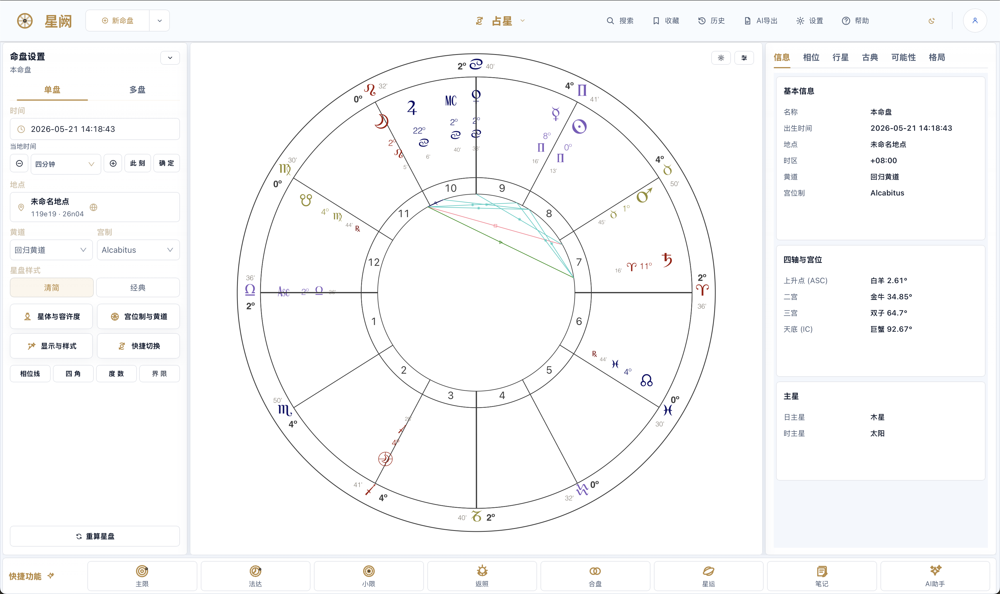
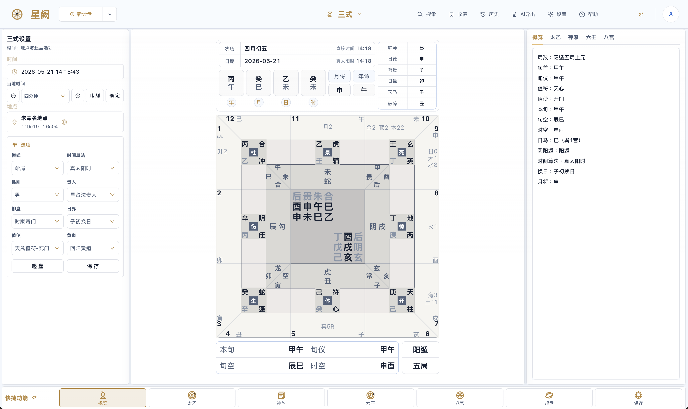
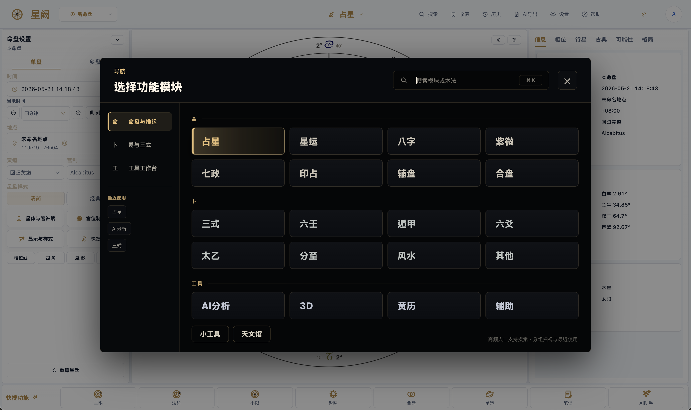

简体中文 | [English](README_EN.md)

# Horosa for macOS

### A desktop metaphysics workstation for Apple Silicon, delivered through a signed offline installer and a notarized release channel

[Portal](README.md) | [Chinese Guide](README_ZH.md) | [v2.1.0 Beta](https://github.com/Horace-Maxwell/Horosa-Web-App-comprehensively-improved-MacOS/releases/tag/v2.1.0)

**Current release:** `v2.1.0 beta`

**Release focus:** `v2.1.0 beta` broadens the traditional-method engine layer, hardens chart/case data management, expands structured AI export coverage, preserves user/window state across launches, and polishes light/dark desktop UI for release testing.

**Licensing note:** the public repository is now distributed under `AGPL-3.0` because the released stack integrates Swiss Ephemeris / `pyswisseph`. Third-party subdirectories keep their own upstream notices.

## Why Horosa Feels Different

This repository certainly handles macOS delivery, but what it delivers is not a thin shell around one chart. Horosa on macOS already behaves like a layered metaphysics workstation: Western astrology, timing systems, relationship analysis, Chinese traditional methods, Yi and Sanshi workflows, Feng Shui, and export-oriented reading are organized as one desktop product rather than scattered tools.

That is the main idea this README should communicate. The installer matters, the notarization matters, but the bigger story is that the release channel is carrying a broad and mature analysis surface.

## What You Can Actually Do

<table>
  <tr>
    <td width="50%">
      <strong>As an end user</strong> 
      Download the offline installer, open Horosa like a finished macOS application, and start working without manually assembling Python, Java, or supporting runtime pieces.
    </td>
    <td width="50%">
      <strong>As a maintainer</strong> 
      Use the same repository to trace the installer project, runtime packaging, GitHub Release page, and publishing flow behind the public desktop delivery.
    </td>
  </tr>
</table>

Primary entry:

- [Horosa-Installer-macos-arm64-offline.pkg](https://github.com/Horace-Maxwell/Horosa-Web-App-comprehensively-improved-MacOS/releases/download/v2.1.0/Horosa-Installer-macos-arm64-offline.pkg)

Best fit:

- first-time installation
- mainland China or weak-network environments
- offline forwarding to another machine or another person
- users who want a first open that does not depend on an extra runtime download

## Preview

  
<strong>Astrology Workspace</strong>

  
  
<em>A three-column astrology workspace with chart controls, a large wheel canvas, detail tabs, and quick actions.</em>

  
<strong>Sanshi Workspace</strong>

  
  
<em>The Sanshi surface keeps the plate, setup panel, overview tabs, and quick-function rail visible in one desktop view.</em>

  
<strong>Navigation Overlay</strong>

  
  
<em>The dark command overlay groups astrology, Yi/Sanshi, workbench tools, and recent modules for fast switching.</em>

## Signature Workflows

### Natal To Timing

Horosa already supports a continuous timing workflow rather than a loose menu of techniques. Users can start with natal and 3D chart reading, then move into primary directions, zodiacal releasing, firdaria, profection, solar arc, returns, and annual methods inside the same desktop environment.

### Relationship Analysis

The relationship layer is broader than a single compare screen. It already includes compare, composite, synastry, time-space midpoint, and Marks charts as distinct ways to inspect the same relationship from different structural angles.

### Chinese Traditional Stack

The Chinese traditional surface is presented as a system, not a decorative side module. Bazi, Ziwei, gua-symbol references, twelve-palace tools, calendar, and Feng Shui already live in the same workspace.

### Yi And Sanshi Depth

Yi and Sanshi go beyond standalone tabs. Horosa already includes Su Zhan, Yi Gua, Liu Ren, Jin Kou, Dun Jia, Tai Yi, Tong She Fa, and a deeper Sanshi United surface.

## Implemented Disciplines

### Western Astrology

The strength here is continuity from natal reading to timing and relationship work.

- natal chart and 3D chart
- primary directions, zodiacal releasing, firdaria, profection, solar arc, returns, and annual methods
- compare, composite, synastry, time-space midpoint, and Marks charts

### Global And Specialty Modules

Horosa goes beyond the default desktop astrology stack.

- Jieqi charts
- astrocartography and planetary maps
- Qizheng Siyu, Hellenistic, Indian, and quantitative views

### Chinese Traditional Systems

The Chinese traditional layer is arranged as a genuine system of entrypoints and references.

- Bazi, Ziwei, gua-symbol references, twelve-palace tools, and rule references
- calendar and Feng Shui as first-class modules
- a workspace that allows cross-reading between different traditions

### Yi And Sanshi

This layer gains its depth from the jump between standalone methods and an integrated analysis surface.

- Su Zhan, Yi Gua, Liu Ren, Jin Kou, Dun Jia, Tai Yi, and Tong She Fa
- Sanshi United with overview, Tai Yi, shensha, Liu Ren, major patterns, sub-patterns, references, and Bagong details
- integrated explanatory depth instead of placeholder tabs

### Tools And Export Workflow

Horosa is not only about calculation. It also provides the controls needed for desktop research and export-oriented interpretation.

- chart configuration
- aspect selection
- planet selection
- chart components
- utility tools
- AI export
- AI export settings

## New In v2.1.0

`2.1.0 beta` is a broad update for the desktop release train. It keeps the signed offline installer path while bringing the newly integrated traditional-method engines into local data management, structured AI export, persistent settings, light/dark theme polish, and desktop delivery verification.

Key additions in this release:

- added and normalized backend integrations for Taiyi, Jin Kou, Huangji/Wangji, Wuzhao, Taixuan, Jingjue, Shenyishu, Kin Astro, Qizheng, Qimen, and related specialty methods
- chart management and case management now preserve new-method inputs, tags, snapshots, raw backend payloads, JSON import/export, and reopening behavior
- AI export now reads from structured backend data and exposes selectable export groups for each supported technique, tab, and page
- user settings, desktop window size, and necessary UI choices are persisted across close/reopen and app updates
- local event management UI was simplified, with useful actions aligned in the same row as chart management
- app-wide light/dark mode contrast, dropdowns, overlays, loading states, management lists, and export controls were audited and polished
- Qimen Dunjia parity and the previous desktop delivery fixes remain preserved
- `2.1.0 / 2.1.0-runtime1` aligned across package metadata, Tauri config, release config, README, manifest, app zip, offline pkg, and runtime archive
- the notarized offline `.pkg` remains the primary install path for clean Apple Silicon machines

## Desktop Delivery

On macOS, the delivery layer is meant to feel native and finished rather than improvised.

- Apple Silicon (`arm64`)
- Developer ID signed
- notarized by Apple
- offline runtime path included in the install flow
- native in-app update path for future releases

The point is not “here is a codebase, please assemble it yourself.” The point is “here is Horosa as a finished desktop product.”

## Current Beta Release

- [GitHub Release v2.1.0 Beta](https://github.com/Horace-Maxwell/Horosa-Web-App-comprehensively-improved-MacOS/releases/tag/v2.1.0)
- [All Releases](https://github.com/Horace-Maxwell/Horosa-Web-App-comprehensively-improved-MacOS/releases)

## FAQ

### Do I Need To Clone The Repo To Use Horosa

No. Regular users should go straight to the latest release and download the offline installer package.

### Do I Need To Install Python Or Java Myself

No. The public offline install path is designed to carry the required runtime setup for you.

### Why Are There Other Files In The Release

Because the installer, updater, notarization flow, and runtime publishing pipeline still need them. They are support assets, not the public recommendation.

### Will Updates Remove My User Data

No. App replacement and runtime switching are designed to update the program and shared runtime, not erase user data.

## Developer Entry

If you maintain this stack, start with the path that matches your goal:

- understand the public-facing repository layout: [README.md](README.md)
- read the full Chinese guide: [README_ZH.md](README_ZH.md)
- inspect installer internals and publishing flow: [Horosa_Desktop_Installer/README.md](Horosa_Desktop_Installer/README.md)
- plan a Windows port and release gate: [Windows porting checklist](docs/windows-porting-and-release-checklist.md)
- read the current beta release page: [GitHub Release v2.1.0 Beta](https://github.com/Horace-Maxwell/Horosa-Web-App-comprehensively-improved-MacOS/releases/tag/v2.1.0)
- enter the application source tree: `Horosa-Web/`
- inspect shared runtime and diagnostics: `runtime/` and `diagnostics/`

## Acknowledgements

This macOS edition is an improved distribution and integration work based on the Horosa App and Web released by Horosa-荀爽（Herakleios）. The lineage matters: Horosa was originally created by 郑大哥, with auxiliary design work from 荀爽（Herakleios）, and their public release made later study, maintenance, and extension possible.

Please do not forget the contributions of 爽哥 and 郑大哥. This repository continues from their groundwork with respect, gratitude, and the hope that Horosa can remain useful to more people over time.

Special thanks also go to [kentang2017](https://github.com/kentang2017) for publicly sharing long-running Python projects for traditional Chinese methods. Horosa v2.1.0 integrates or adapts several of those calculation engines; upstream projects identified as MIT-licensed are documented in `THIRD_PARTY_NOTICES.md` and their vendored directories, while projects without an explicit open-source license declaration are listed separately to avoid mixing license assumptions.
